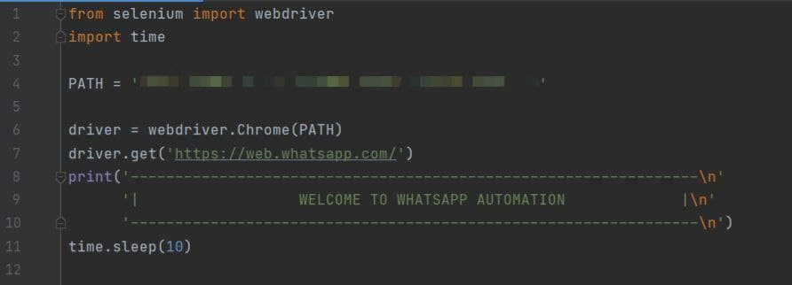
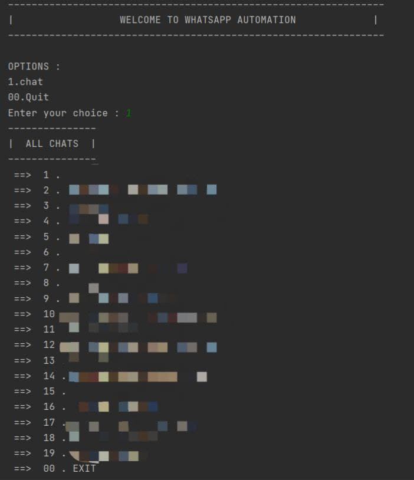

# workflow

``` bash
First replace the PATH with the path of the chrome driver.
```


``` bash
list of all contacts will appear on the command line
```


``` bash
On choosing choice-1 : single message command
```


``` bash
On choosing choice-2 : spamming with message command
```

