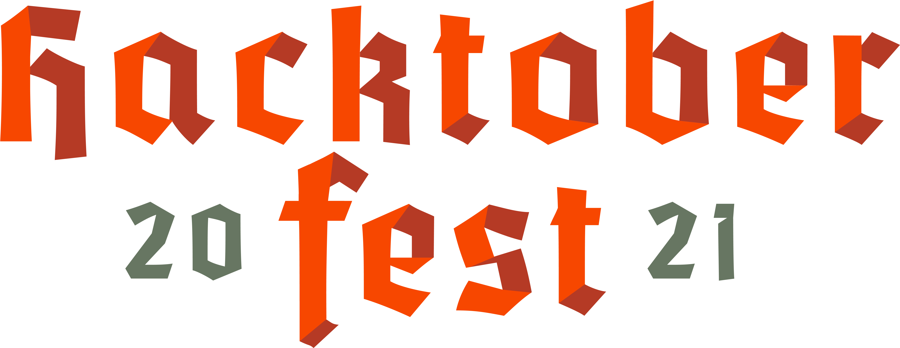

[](https://hacktoberfest.digitalocean.com/)
## [Hactoberfest FAQs](https://hacktoberfest.digitalocean.com/faq)
# Programming-Basics
<div align="center">

    

 


[](https://github.com/Astrodevil/Programming-Basics/issues)
[](https://github.com/Astrodevil/Programming-Basics/network)
[](https://github.com/Astrodevil/Programming-Basics/stargazers)

</div>

# About❓
Want to start your open-source journey? You are at right place🎯

Don't know how to begin your journey in Hacktober fest 2021? Follow our [tutorials](https://github.com/nitinkumar30/Programming-Basics/tree/main/How%20to%20begin%20with%20hacktober%20fest%202021).

This project contains basic solutions, source codes, book pdfs related to different programming languages🤗. As everyone is learning one or many programming languages, so contribution to this project will be very easy for you.

You can also take help from this project towards your learning or you can contribute to make this more helpful for others.

**So, What are you waiting for?**

# Contributing Guidelines📝
Thank you for your interest in contributing to our Repo! Pull requests are welcome. For major changes, please open an issue first to discuss what you would like to change.


To start contributing, follow the below guidelines: 

**1.**  **Star** and **Fork** [this](https://github.com/Astrodevil/Programming-Basics) repository.

**2.**  Clone your forked copy of the project.

```
git clone https://github.com/<your_user_name>/Programming-Basics.git
```

**3.** Navigate to the project directory :file_folder: .

```
cd Programming-Basics
```

**4.** Add a reference(remote) to the original repository.

```
git remote add upstream https://github.com/Astrodevil/Programming-Basics.git 
```

**5.** Check the remotes for this repository.

```
git remote -v
```

**6.** Always take a pull from the upstream repository to your master branch to keep it at par with the main project(updated repository).

```
git pull upstream main
```

**7.** Create a new branch.

```
git checkout -b <your_branch_name>
```

**8.** Perfom your desired changes to the code base.

**9.** Track your changes:heavy_check_mark: .

```
git add . 
```

**10.** Commit your changes .

```
git commit -m "Relevant message"
```

**11.** Push the committed changes in your feature branch to your remote repo.

```
git push -u origin <your_branch_name>
```

**12.** To create a pull request, click on `compare and pull requests`.

**13.** Add appropriate title and description to your pull request explaining your changes and efforts done.

**14.** Click on `Create Pull Request`.


**15.** Woohoo! You have made a PR to the Programming-Basics :boom: . Wait for your submission to be accepted and your PR to be merged.

Not able to understand how to contribute? Let's go through [simple tutorisls](https://github.com/nitinkumar30/Programming-Basics/tree/main/How%20to%20begin%20with%20hacktober%20fest%202021) on how to begin.

**Thank you for your interest in contributing to our Repo!🏼**

**Kudos to you🎈**


# Our valuable Contributors👩‍💻👨‍💻 :
<a href="https://github.com/Astrodevil/Programming-Basics/graphs/contributors">
  
</a>
